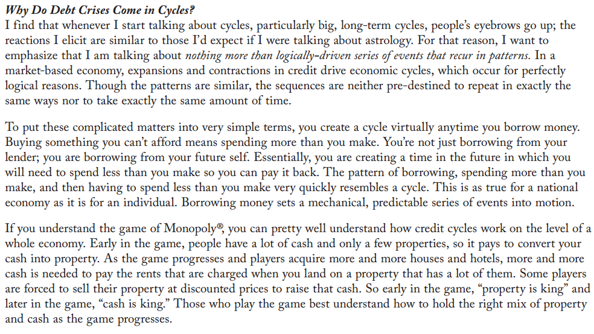
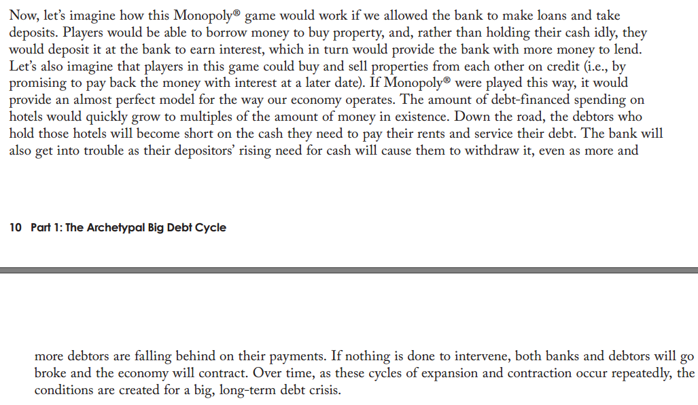
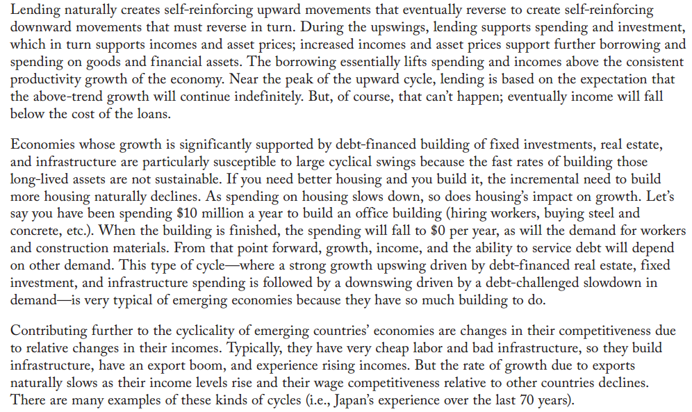
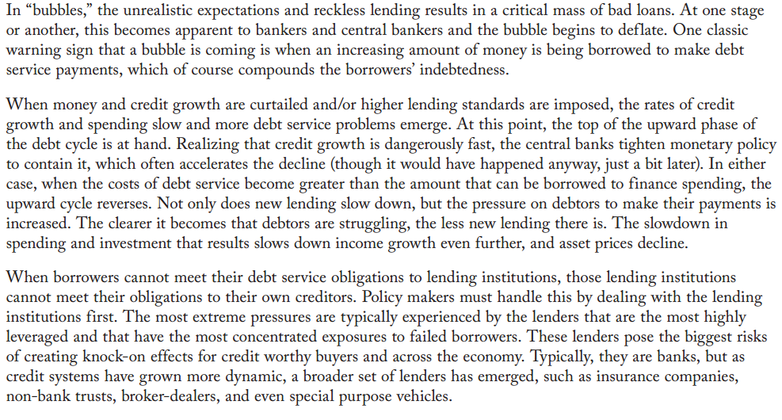

# 杂记@20181014

# 1.十一金融大事
## 随着美联储说要加息，而央妈在节日前发消息说降准，说明要增加流动性。开始怀疑是否已经发现什么迹象，节后有大事，需要给大家打个鸡血。
## **但是现阶段的预期能够改变么？**
## 但是可怕的是在假期中美股港股大跌，造成节后连续一周整体都是跌跌跌，堪称股灾。
### 从以往经验，股市大跌长期低位，那么很多投资者，包括个人或企业，就没有充裕的资金，进行消费或再生产。更有甚者，资金断裂，无法偿还债务。
### 进而传导到其他金融经济领域，包括就业、房地产、民生。

# 2.房地产迷思
## 随着9月10月这两个敏感的房地产销售时期，无论是房企自己要说活下去，还有各种不好的消息。例如房地产税，利率飙高，住房贷款政策收紧等。果然名义上活动降价销售，实则真的要赶紧出手。
## 同时不断爆出房子出现很多问题。同时降价销售导致之前购买的开始闹。正常人的预期都在观望，不是不想下手，而是实在下不了手。
## 果然十一假期业绩实在难看。看后面债务怎么撑吧。

# 3.消费欲望
## 消费者有点闲钱，就想去旅游，享受高品质生活。这个也是迷惑的地方，有点两极化。相当一部分背负房贷，不敢过多消费。泡面老干妈之流又被提起。但同时会发现人民群众的钱还是很多啊，各种消费。

# 4.经济周期
## 通胀期，借贷投资，投资资产收益来得快，鼓励大家消费投资，收入也随着上升。而随着生产力饱和，收入上升缓慢，而资产继续虚高。流动性变慢，债务总有无法偿还的时候。多米诺骨牌效应，后续

节选dalio的大作

